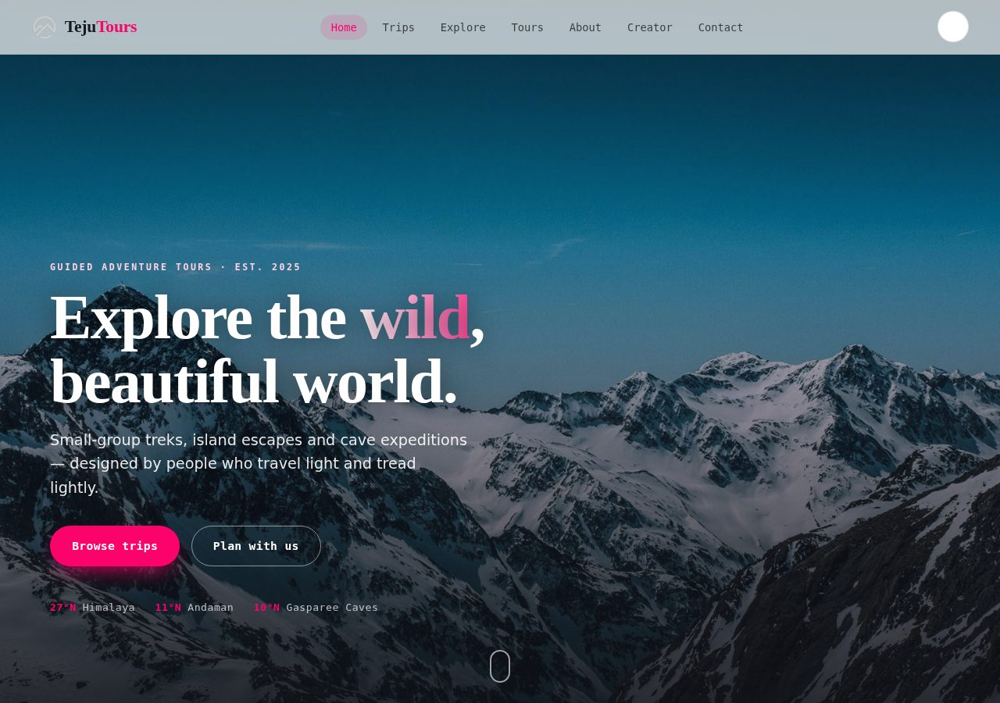
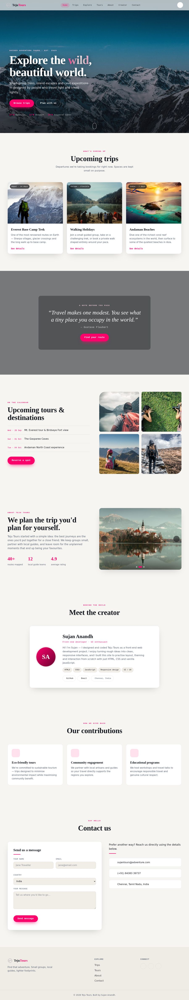
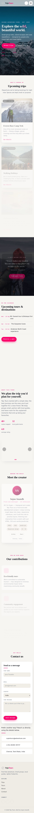

<div align="center">

# 🏔️ Teju Tours

### A responsive, single-page tourism website for a small-group adventure travel brand.

Built from scratch with **HTML, CSS and vanilla JavaScript** — no frameworks, no build step.

[**View the live demo →**](#-getting-started) &nbsp;·&nbsp; [Report a bug](https://github.com/SujanTheMagician/Tourism-Website/issues)

<br />



</div>

---

## ✨ About the project

**Teju Tours** is the website for a fictional adventure-travel company that runs small-group
treks, island escapes and cave expeditions. The goal of the project was to design and build a
polished, modern landing page end-to-end — focusing on clean layout, an intentional visual
identity, smooth interactions and solid accessibility, all with plain web technologies.

It was created as a Front-End Web Development project, and rebuilt into the version you see here
with a proper design system, working JavaScript and optimised assets.

<table>
<tr>
<td width="50%"></td>
<td width="50%" align="center"></td>
</tr>
<tr>
<td align="center"><em>Light theme</em></td>
<td align="center"><em>Mobile layout</em></td>
</tr>
</table>

---

## 🎯 Features

- **Light / dark theme** — toggle in the navbar, remembers your choice (`localStorage`) and respects your system preference on first visit.
- **Fully responsive** — fluid layouts that adapt from large desktops down to small phones, with a slide-in mobile menu.
- **Scroll-aware navigation** — the active section is highlighted automatically as you scroll (`IntersectionObserver`).
- **Image carousel** — auto-advancing gallery with prev/next controls, dot indicators and pause-on-hover.
- **Scroll-reveal animations** — sections fade and rise into view; disabled automatically for users who prefer reduced motion.
- **Validated contact form** — friendly inline validation and a success message, all client-side.
- **Back-to-top button** — appears after scrolling and glides smoothly to the top.
- **Accessibility built in** — skip link, keyboard focus styles, ARIA labels and reduced-motion support.
- **Performance-minded** — images compressed from ~18 MB down to ~1.3 MB, lazy-loaded, with preconnected fonts.

---

## 🗂️ Page sections

`Home` · `Trips` · `Explore` · `Tours` · `About` · `Creator` · `Contact` — plus a footer.
The **Creator** section is a short "about me" profile for the developer.

---

## 🛠️ Tech stack

| Area        | Choice                                                        |
| ----------- | ------------------------------------------------------------- |
| Markup      | Semantic HTML5                                                |
| Styling     | Modern CSS (custom properties, grid, flexbox, `clamp()`)      |
| Behaviour   | Vanilla JavaScript (ES6, no dependencies)                     |
| Typography  | Fraunces (display) · Manrope (body) · Space Grotesk (labels)  |
| Icons       | Font Awesome 6                                                |

---

## 📁 Project structure

```
Fewd_Project/
├── index.html            # All page markup
├── css/
│   ├── style.css         # Design system + components
│   └── responsive.css    # Media queries / mobile rules
├── js/
│   └── script.js         # Theme, nav, carousel, form, reveals
├── img/                  # Optimised images + favicons
└── screenshots/          # Preview images for this README
```

---

## 🚀 Getting started

No build tools or installation required — it's a static site.

```bash
# 1. Clone the repository
git clone https://github.com/SujanTheMagician/Tourism-Website.git
cd Tourism-Website/Fewd_Project

# 2. Open it
#    Option A — just double-click index.html
#    Option B — run a tiny local server (recommended)
python3 -m http.server 5500
#    then visit http://localhost:5500
```

> **Tip:** if you use VS Code, the *Live Server* extension works great here.

---

## 🎨 Make it yours

- **Brand & copy** — text lives directly in `index.html`; colours and fonts are CSS variables at the top of `css/style.css` (`--rose`, `--bg`, `--ff-display`, …).
- **Creator photo** — the profile uses an initials avatar. To use a real photo, replace the
  `<div class="creator__avatar">` block with ``.
- **Images** — drop replacements into `img/` using the same names, or update the paths in `index.html`.
- **Contact form** — validation is client-side only. To actually receive messages, point the form
  at a service like Formspree or your own backend in `js/script.js`.

---

## 👤 Creator

**Sujan Anandh** — front-end developer
[GitHub @SujanTheMagician](https://github.com/SujanTheMagician)

---

## 📄 License

Released under the [MIT License](LICENSE). Photographs are used for demonstration purposes.
